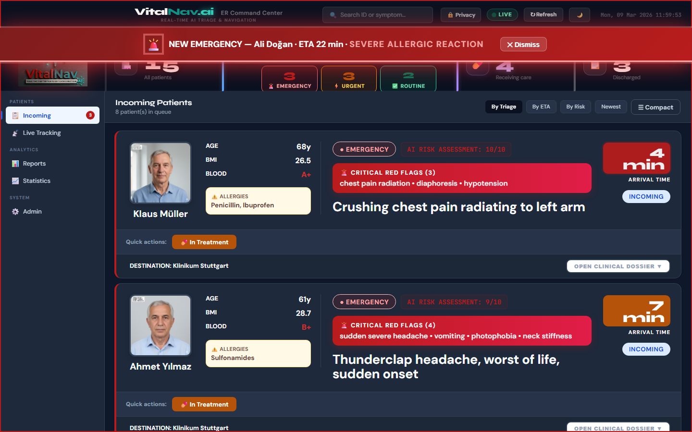
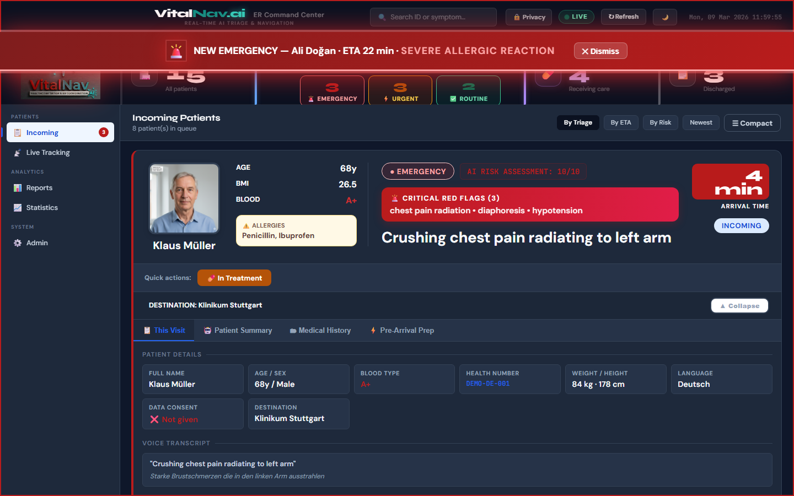
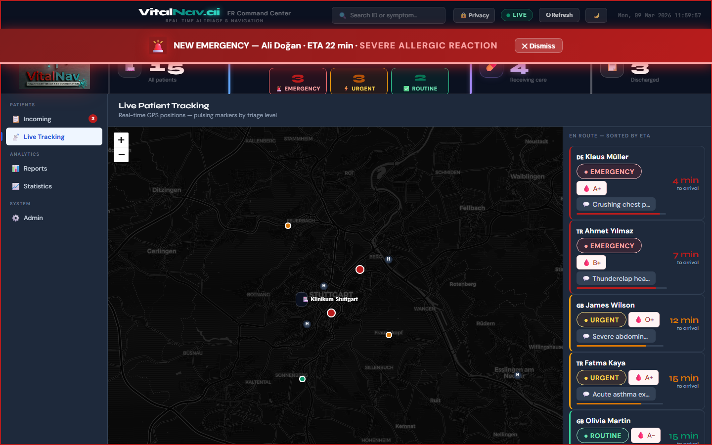
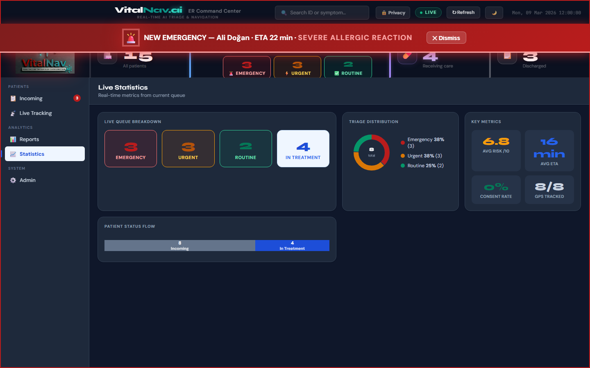
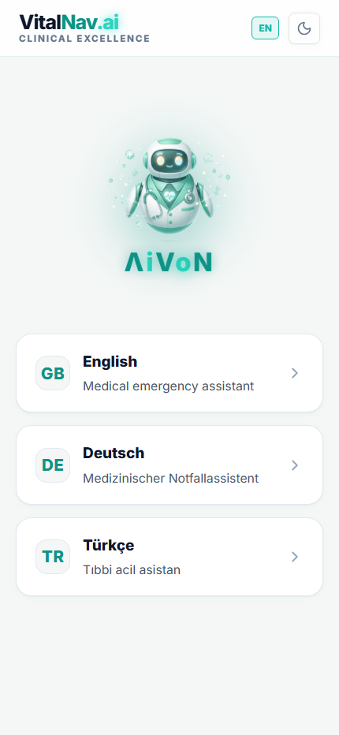
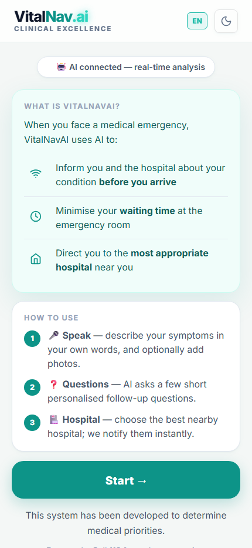
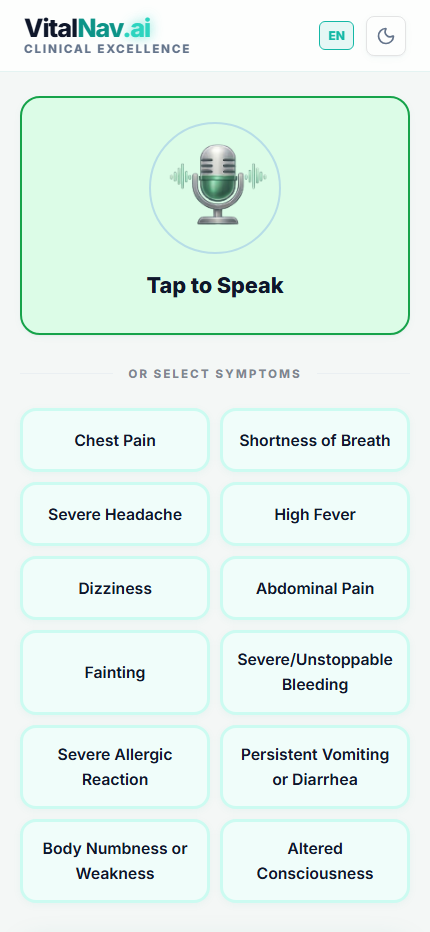
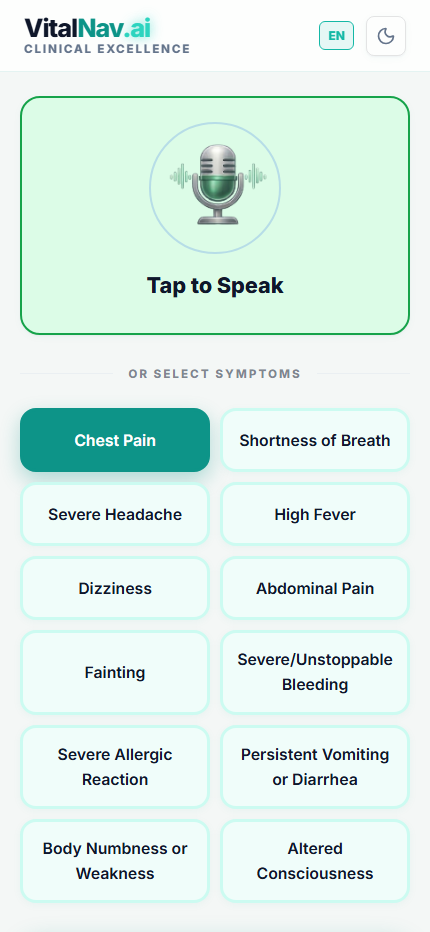
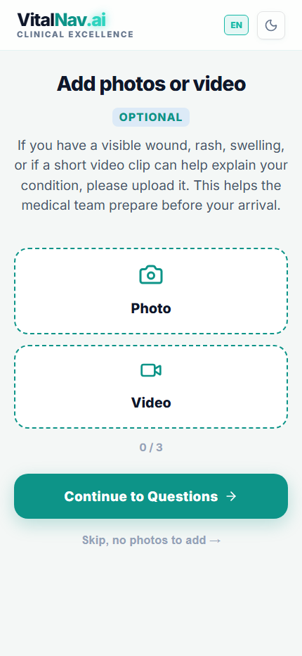
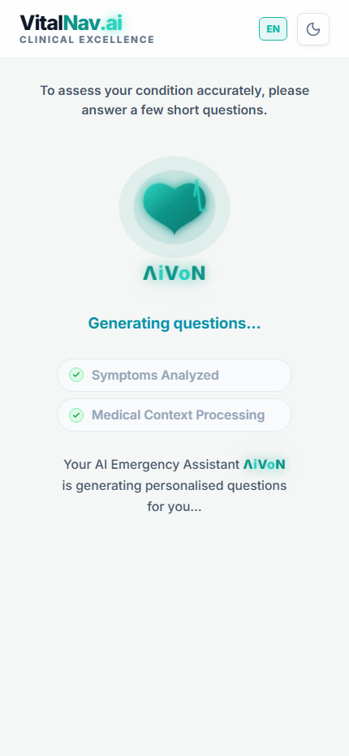

<div align="center">
  
  <br/>
  
  # VitalNav.Ai ⚡🏥
  **AI-Powered Pre-Hospital Triage System**  
  Voice-First + RAG + Real-time GPS + Manchester Triage System

  [](https://www.python.org)
  [](https://fastapi.tiangolo.com)
  [](https://azure.microsoft.com/en-us/products/ai-services)
  [](https://openai.com)
  [](https://www.gnu.org/licenses/agpl-3.0)

  [🚀 Quick Start](#-quick-start) · [🎯 How It Works](#-how-it-works) · [✨ Features](#-key-features) · [🏗️ Architecture](#️-architecture) · [🔌 API Reference](#-api-reference) · [🎬 Demo Scenarios](#-demo-scenarios)
</div>

---

## ⚡ At a Glance

<table>
<tr>
<td width="33%" align="center">

### 🚨 Problem
Emergency rooms receive patients **without any prior information**. Triage happens only *after* arrival — wasting the most critical minutes and overloading ER staff with incomplete data.

</td>
<td width="34%" align="center">

### 💡 Solution
A **two-sided AI platform**: patients describe symptoms via voice before arrival; the ER dashboard receives a complete clinical picture — triage level, risk score, live GPS, and medical history — *before the patient walks in*.

</td>
<td width="33%" align="center">

### 🏗️ Architecture
```
Patient (Mobile)
      │  voice / text
      ▼
  FastAPI Server
      │
  ┌───┴────┐
Azure AI  SQLite
GPT-4/STT  Queue
      │
ER Dashboard
 (Browser)
```

</td>
</tr>
</table>

### 📈 Impact

| | |
|:---|:---|
| 🕐 **ER is briefed before you arrive** | Before the patient walks in, doctors already have: triage level, risk score, chief complaint, injury photos, voice transcript, medical history, allergies & current medications |
| 🌍 **Patient speaks their language — doctor reads theirs** | Symptoms described in Turkish, clinical summary received in English. Each side communicates in their own language |
| 🗺️ **All incoming patients tracked live on one map** | GPS positions updated every 4 seconds, colour-coded by triage severity — ER sees the full incoming caseload at a glance |
| 🏥 **Routed to the best available hospital** | Not just the nearest — ranked by real ETA + occupancy. A full ER is deprioritised automatically |
| 🚑 **Ambulance dispatched instantly for critical cases** | IMMEDIATE patients get an in-app ambulance tracker; the ER receives the dispatch note simultaneously |
| 👨‍⚕️ **Physician overrides AI before patient arrives** | Upgrade, downgrade, or approve triage from the dashboard — decision reflected on the patient's screen in real time |
| 📶 **Works with zero infrastructure** | Full demo mode with offline AI fallback, 440-hospital database, and browser-based voice input — no cloud account needed |

---

### 🛠️ Tech Stack

| Layer | Technology |
|:---|:---|
| **Backend** | Python 3.11 · FastAPI · SQLite |
| **AI / NLP** | Azure OpenAI GPT-4 · Azure Speech STT · Azure Translator · Azure AI Search (RAG) |
| **Mapping** | Azure Maps · Leaflet.js · Real-time GPS streaming |
| **Frontend** | Vanilla HTML/CSS/JS · TailwindCSS · ApexCharts · Zero build step |
| **Infrastructure** | Azure Document Intelligence · Azure Content Safety · 440-hospital offline DB |

> 📖 **For full feature details, architecture diagrams, API reference, and demo scenarios — continue reading below.**

---

> [!CAUTION]  
> **Medical Disclaimer** — This is an educational and demonstration project.  
> It is **NOT** a certified medical device and must **NOT** be used for real clinical triage decisions.  
> In any real medical emergency, always call **112** (Europe) or **911** immediately.

> [!IMPORTANT]  
> **License**  
> This project is licensed under the **GNU Affero General Public License v3.0 (AGPL-3.0)**.  
> You are free to use, modify, and distribute it for **non-commercial and open-source purposes**, as long as any modifications or derivative works are also released under AGPL-3.0 and the full source code is provided.  
> 
> **Commercial use, SaaS hosting, enterprise deployment, or any closed-source usage requires a separate commercial license.**  
> For commercial licensing inquiries, please contact: **atamererkal.eu@gmail.com**

---

## 🧠 What is VitalNav.Ai?

**VitalNav.Ai** is a full-stack, AI-powered pre-hospital triage platform with two complementary interfaces:

- **VitalNavAI** — a mobile-first patient app where anyone can describe their emergency via voice or text, answer AI-guided clinical questions, and receive a 5-level Manchester Triage System (MTS) assessment.
- **ER Command Center** — a real-time hospital dashboard where ER staff see incoming patients, their AI-assessed triage level, live GPS location, estimated arrival time, physician override controls, and notes — *before* the patient arrives.

Unlike simple symptom checkers, VitalNav.Ai creates a **live two-way bridge** between patient and hospital. An **Expert-in-the-Loop** mechanism allows ER physicians to review, approve, upgrade or adjust the AI triage decision in real time.

<br/>

## ✨ Key Features

<table>
<tr>
<td width="50%">

### 🎙️ Voice-First, Any Language
Speak in your native language — Azure Speech SDK transcribes audio using the patient's selected language for maximum accuracy. A Web Speech API fallback ensures voice input works in all modern browsers without any credentials. A live waveform animation gives real-time feedback. Transcript approval step lets patients confirm before continuing.

### 🧬 Condition-Specific AI Questions
GPT-4 generates **clinically relevant, diagnosis-deepening follow-up questions** grounded in real medical guidelines via RAG. Questions are specific to the patient's exact complaint — chest pain gets STEMI rule-out questions, leg swelling gets DVT risk questions. **15+ condition-specific clinical protocols** cover the most common ER presentations.

### 📊 5-Level MTS Triage (Manchester Triage System)
A visual progress bar guides patients through: Language → Welcome → Complaint Input → Photo Upload → AI Questions → Consent → Triage Result. The AI maps every assessment to the full MTS scale: **IMMEDIATE · EMERGENCY · URGENT · STANDARD · NON_URGENT** — with distinct outcome flows for each level.

</td>
<td width="50%">

### 🗺️ Real-Time GPS Tracking
The patient's live position streams continuously to the ER dashboard via `watchPosition`. The map shows each incoming patient's exact location and trajectory, updated every 4 seconds. IMMEDIATE/EMERGENCY patients have in-app animated ambulance tracking. STANDARD/NON_URGENT patients are excluded from the server simulation (they navigate themselves).

### 🏥 Live ER Command Center
Multi-panel dashboard with sortable patient cards (by Risk Score, ETA, Time), KPI strip, triage breakdown chips, full-screen Leaflet map, resource status KPIs, statistics charts, and CSV export. Emergency patient arrivals trigger a prominent full-width alert banner. Ambulance dispatch events are annotated directly on patient cards with estimated hospital arrival time.

### 👨‍⚕️ Expert-in-the-Loop Physician Review
After AI triage, a physician polling card appears on the patient's screen. ER doctors can **APPROVE**, **UPGRADE**, or **ADJUST** the triage level with a clinical note. The patient's screen updates in real-time to reflect the physician's decision, cumulative notes are preserved chronologically.

</td>
</tr>
</table>

<br/>

## 🎯 How It Works

```
  ╭──────────────────────────────────────────────────────────────────────╮
  │                      THE PATIENT JOURNEY                             │
  ╰──────────────────────────────────────────────────────────────────────╯

  ┌──────────┐    ┌───────────┐    ┌───────────────┐    ┌──────────────┐
  │ 🗣️ SPEAK  │───▶│ 🌍 DETECT  │───▶│ 🤖 ASSESS     │───▶│ 🏥 ROUTE     │
  │  or TYPE  │    │ LANGUAGE  │    │ & QUESTION   │    │ TO HOSPITAL  │
  └──────────┘    └───────────┘    └───────────────┘    └──────────────┘
       │                │                  │                    │
       ▼                ▼                  ▼                    ▼
  "My leg is       Auto-detected:    5 targeted Qs       Top 3 hospitals
   swollen and     🇩🇪 German         specific to         ranked by
   red since       → continues       DVT/thrombosis:     Effective ETA
   I flew back"    in Deutsch        • Swelling/warmth?  (travel time +
                                     • Recent travel?    occupancy load)
                                     • Injury or not?
                                     • Previous DVT?
                                     • Pain level?
                                          │
                                          ▼
                                   ┌─────────────────┐
                                   │  MTS 5-LEVEL     │
                                   │  IMMEDIATE  ─────┼─▶ 🚨 Ambulance
                                   │  EMERGENCY  ─────┼─▶ 🚑 Transport
                                   │  URGENT     ─────┼─▶ ⚡ ER + GPS
                                   │  STANDARD   ─────┼─▶ 🏥 Self-nav
                                   │  NON_URGENT ─────┼─▶ 💙 Self-care
                                   └─────────────────┘
                                          │
                                          ▼
                                   👨‍⚕️ PHYSICIAN REVIEW
                                   (approve / upgrade / note)
                                   → reflected on patient screen
```

**On the hospital side:**

```
  ╭──────────────────────────────────────────────────────────────────────╮
  │                   ER COMMAND CENTER — LIVE FEED                      │
  ╰──────────────────────────────────────────────────────────────────────╯

  ┌─────────────────────────────────────────────────────────────────────┐
  │  📊 KPI Strip   Total | En Route | Under Treatment | Discharged      │
  │  🔔 Alert Banner  EMERGENCY arriving in 4 min — Suspected DVT        │
  ├────────────────────────┬────────────────────────────────────────────┤
  │  📋 Patient Cards      │  🗺️ Live Leaflet Map                        │
  │                        │                                            │
  │  Sort: Risk│ETA│Time   │  Patient pins with triage colour coding     │
  │  Filter: By Triage     │  Real-time GPS tracks (updates every 4s)   │
  │  Level (click chips)   │  Route lines to hospital                   │
  │                        │                                            │
  │  ┌───────────────────┐ │  ┌─────────────────────────────────────┐  │
  │  │ 🚨 VN-2026-4821   │ │  │  Resource KPIs                      │  │
  │  │ Chest Pain · 22F  │ │  │  👨‍⚕️ Available Doctors: 3            │  │
  │  │ ETA: 6 min        │ │  │  🛏️ Available Beds: 4               │  │
  │  │ 🚑 Ambulance note │ │  │  📋 Recent Assignments: 7            │  │
  │  │ 👨‍⚕️ Dr note (log) │ │  │  📊 System Load: 62%               │  │
  │  └───────────────────┘ │  └─────────────────────────────────────┘  │
  └────────────────────────┴────────────────────────────────────────────┘
```

<br/>

## 🏗️ Architecture

<div align="center">

</div>

<br/>

```
┌──────────────────────────────────────────────────────────────────────────┐
│                 PATIENT  ←──  Mobile / Desktop Browser                   │
│                                                                          │
│   ui/patient_app_v13.html  ────────────────────▶  FastAPI Server         │
│   (VitalNavAI — standalone HTML, zero build step)   hospital_server_v1   │
│                                                      :8001               │
│                                                           │              │
│   ┌───────────────────────────────────────────────────────┴────────┐    │
│   │                     Azure AI Services                          │    │
│   │                                                                │    │
│   │  ┌──────────────┐  ┌──────────────┐  ┌────────────────────┐   │    │
│   │  │ Azure Speech │  │ Azure OpenAI │  │  Azure AI Search   │   │    │
│   │  │ STT · Direct │  │ GPT-4 / 5   │  │  Medical Knowledge │   │    │
│   │  │ Lang or Auto │  │ + RAG Triage │  │  Semantic Ranking  │   │    │
│   │  └──────────────┘  └──────────────┘  └────────────────────┘   │    │
│   │                                                                │    │
│   │  ┌──────────────┐  ┌──────────────┐  ┌────────────────────┐   │    │
│   │  │ Azure Trans- │  │  Azure Maps  │  │  Azure Content     │   │    │
│   │  │ lator 100+   │  │  ETA + Route │  │  Safety (optional) │   │    │
│   │  │ Languages    │  │  Live Traffic│  │  Input Filtering   │   │    │
│   │  └──────────────┘  └──────────────┘  └────────────────────┘   │    │
│   └────────────────────────────────────────────────────────────────┘    │
│                                                                          │
│   SQLite Patient Queue  ←──  hospital_queue.py (GDPR-compliant)          │
│   Health Records DB     ←──  health_db.py (30 demo patients)            │
│                                    │                                     │
│   ui/hospital_dashboard_v10.html ◀─┘  ER Staff Command Center           │
│   (standalone HTML — Leaflet map, sort, filter, live GPS, physician UI) │
└──────────────────────────────────────────────────────────────────────────┘
```

<br/>

## ☁️ Azure Services

| Service | Role in VitalNav.Ai | AI-102 Domain | Fallback |
|:---|:---|:---:|:---|
| **Azure OpenAI** (GPT-4/5) | Condition-specific question generation, triage assessment, clinical report | Generative AI | Rule-based engine + 15 clinical mock sets |
| **Azure AI Search** | Medical knowledge base — semantic RAG retrieval | Knowledge Mining | Local file keyword matching |
| **Azure AI Document Intelligence** | Extract clinical text from PDF guidelines | Knowledge Mining | Manual text files |
| **Azure Speech Services** | Voice input — direct language mode or auto-detection (4 languages) | NLP | Browser Web Speech API |
| **Azure Translator** | Real-time question/answer translation (100+ languages) | NLP | GPT translation fallback |
| **Azure Maps** | ETA with live traffic, nearest hospital routing | Plan & Manage | Haversine + 440-hospital DB |
| **Azure Content Safety** | Filter harmful input from patients | Responsible AI | Local allowlist filter |

> **Resilience first.** Every Azure service has a tested graceful fallback — the system works fully offline with zero credentials configured.

<br/>

## 🧬 AI Clinical Question Engine

The heart of VitalNav.Ai is its **condition-specific question generation** — a significant improvement over generic symptom checklists.

### How questions are generated

```
Chief Complaint (English)
         │
         ▼
  ┌──────────────┐
  │  RAG Search  │ ◀── Azure AI Search (medical guidelines)
  │  Guidelines  │
  └──────────────┘
         │ context injected into prompt
         ▼
  ┌───────────────────────────────────────────────────────┐
  │  GPT System Prompt — 5 mandatory question slots:      │
  │                                                       │
  │  Q1 → Worst-case RED FLAG rule-out for THIS complaint │
  │  Q2 → Character / quality of the main symptom        │
  │  Q3 → Onset, timing, or trigger SPECIFIC to complaint│
  │  Q4 → Associated symptom diagnostically significant  │
  │  Q5 → Medical background relevant ONLY to complaint  │
  │                                                       │
  │  + Demographics adaptation (age, sex)                 │
  │  + Forbidden generics list                            │
  └───────────────────────────────────────────────────────┘
         │
         ▼
  JSON parse (robust extraction from prose)
         │
         ▼
  Azure Translator → patient's language
         │
         ▼
  Patient sees targeted, clickable questions
```

### Condition-specific mock protocols (offline fallback)

When AI is unavailable, 15 hand-crafted clinical protocols activate automatically:

| Complaint Group | Key Assessment Focus |
|:---|:---|
| Chest / Cardiac | Radiation pattern, diaphoresis, STEMI timing, cardiac history |
| Head / Stroke (FAST) | Sudden onset, facial droop, arm weakness, speech, time window |
| Abdominal / GI | Pain location, peritonitis signs, bowel changes, surgical history |
| Respiratory / Breathing | SpO2 proxy (cyanosis), wheeze, triggering exposure, asthma history |
| Back Pain | Radiation to leg, cauda equina red flags, mechanism, neuro signs |
| Leg Pain / DVT | Swelling/warmth, recent surgery/travel, injury vs. spontaneous |
| Arm / Shoulder | Mechanism, ROM, neurovascular compromise, deformity |
| Fever / Sepsis | Temperature grade, meningism signs, UTI, travel/exposure |
| Dizziness / Syncope | Vertigo vs. presyncope, loss of consciousness, orthostatic |
| Allergy / Anaphylaxis | Airway threat (lip/throat), trigger, development speed, bronchospasm |
| Trauma / Injury | Mechanism, body region, bleeding control, head LOC |
| Eye Emergency | Vision loss (sudden), chemical exposure, floaters, redness |
| Urinary / Renal | Dysuria, flank pain, fever, stone/UTI history |
| Neck Pain | Meningismus test, trauma, headache+fever combo, radiculopathy |
| Diabetes | Type, glucose level, DKA signs, medication compliance |

<br/>

## 📊 MTS 5-Level Triage Outcomes

Each triage level triggers a distinct patient flow:

| Level | Colour | Patient Flow | Dashboard |
|:---|:---:|:---|:---|
| 🔴 **IMMEDIATE** | Red | In-app ambulance dispatch → animated ambulance tracker → hospital ETA | `🚑 AMBULANCE` dispatch note + total arrival ETA |
| 🟠 **EMERGENCY** | Orange | Choose ambulance or self-transport → ambulance tracker OR GPS triage page | Ambulance note or URGENT tracking |
| 🟡 **URGENT** | Yellow | GPS triage page → hospital list → live tracking → physician polling | Live GPS pin, ETA countdown |
| 🟢 **STANDARD** | Green | Self-care instructions → physician polling (no GPS simulation) | `incoming` status, no auto-movement |
| 🔵 **NON_URGENT** | Blue | Full self-care guidance → optional physician review | `incoming` status |

<br/>

## 👨‍⚕️ Expert-in-the-Loop Physician Review

After submission, a live polling card appears on the patient's screen for URGENT, STANDARD, and NON_URGENT patients. ER physicians can act from the dashboard without the patient having to do anything:

```
  Dashboard (Doctor side)              Patient screen
  ─────────────────────                ──────────────────────────
  [APPROVE]  [UPGRADE]  [ADJUST]  ───▶  🔁 Expert Review Active
       │          │                          ↓ (decision arrives)
       │          └─ new_level: URGENT  ───▶  ⚠️ Physician upgraded your
       │             note: "Elevated         assessment to URGENT
       │              troponin pattern"  ───▶  [Proceed to URGENT flow]
       │
       └─ APPROVE ──────────────────────▶  ✅ Your assessment confirmed
```

- Decisions are reflected **immediately** on the patient's screen (polling every 5 s for URGENT, 15 s for NON_URGENT)
- Physician notes accumulate chronologically — never overwritten
- On UPGRADE, `S.assessment.triage_level` is updated client-side so all subsequent navigation shows the new level

<br/>

## 🗺️ Real-Time Patient Tracking

The patient app continuously streams GPS coordinates to the ER dashboard:

```javascript
// Patient side — runs every 4 seconds (URGENT/EMERGENCY/IMMEDIATE only)
navigator.geolocation.watchPosition(async position => {
    await fetch(`/api/patient/${regNumber}/location`, {
        method: 'PATCH',
        body: JSON.stringify({ lat, lon, eta_minutes })
    });
});
```

```python
# Server background thread — moves patients toward hospital every 5 s
# Only runs for patients with status='incoming' AND location_lat IS NOT NULL
# STANDARD/NON_URGENT patients submit without GPS → excluded from simulation
```

The ER Leaflet map refreshes pin positions every 5 seconds — giving staff a live operational picture of all en-route patients with colour-coded triage severity.

<br/>

## 🏥 ER Command Center — Dashboard Features (v10)

### Screenshots

<div align="center">

**Incoming Patients — Emergency Alert + Triage Cards**


<br/>

**Patient Detail — Clinical Dossier (This Visit tab)**


<br/>

| Live GPS Tracking Map | Real-Time Statistics |
|:---:|:---:|
|  |  |

</div>

### Patient Card System
- Smart diff rendering — cards update in-place (no flicker on refresh)
- Expandable detail panel with 4 tabs: **Overview**, **Q&A Transcript**, **Clinical AI Report**, **Media**
- Medical history pulled from health DB (ICD-10 codes, medications, allergies, labs)
- Ambulance dispatch events shown as annotated notes on the card
- Physician notes displayed as a **chronological timeline** — each entry timestamped with action and level

### Sorting & Filtering
| Control | Behaviour |
|:---|:---|
| **By Risk Score** | Descending AI risk score (0–10) — highest priority patients first |
| **By ETA** | Ascending arrival time — soonest first |
| **By Time** | Most recently registered patient first |
| **Triage Chips** | Click any of the 5 triage level chips to filter the patient list instantly |
| **KPI Cards** | Click Total, En Route, Under Treatment, or Discharged to filter by status |

### KPI & Resource Panels
| Metric | Description |
|:---|:---|
| **Total Patients** | All registered patients in the current session |
| **En Route** | Patients currently traveling to hospital (status: incoming) |
| **Under Treatment** | Patients currently in active treatment |
| **Discharged** | Patients successfully discharged |
| **Triage Breakdown** | Interactive 5-chip bar: Immediate / Emergency / Urgent / Standard / Non-Urgent |
| **Available Doctors** | Live count with average response time |
| **Available Beds** | Total with ICU / ER / General Ward breakdown |
| **Recent Assignments** | Doctor–patient assignments in last 2 hours |
| **System Load** | Overall ER capacity utilisation percentage |

### Emergency Alert System
When a new EMERGENCY/IMMEDIATE-level patient registers, the dashboard triggers:
- Full-width crimson banner with animated pulse effect
- Patient name, complaint, and ETA prominently displayed
- Auto-dismisses after 10 seconds or on manual close

### Additional Panels
- **Live Tracking Map** — Leaflet map with patient pins, colour-coded by triage; dark/light tile switching; Active Transports sidebar + detailed Transport Details table
- **Doctor Panel** — Real-time doctor workload view with per-patient assignments
- **Bed Management** — Full grid with filter by Department, Type, and Status; Summary KPIs (Total / Available / Occupied / Maintenance)
- **Reports & Analytics** — Daily, Weekly, Monthly, Yearly tabs with triage breakdown, risk distribution histogram, top conditions, CSV export
- **Dark / Light Mode** — One-click toggle with instant map tile swap and full theme adaptation (glassmorphism dark ↔ clinical white)
- **Collapsible Sidebar** — Minimise to icon-only mode for more screen real estate
- **Modern Clock Widget** — Live time and date display in header
- **Keyboard Navigation** — Arrow keys, Enter (expand), Escape (collapse) on patient list
- **Compact Mode** — Toggle between full and condensed card view
- **Multi-Language UI** — EN / TR / DE switcher in header

<br/>

## 📱 Patient App — VitalNavAI (v13)

### Screenshots

<div align="center">

| Language Selection | Welcome Screen |
|:---:|:---:|
|  |  |

| Symptom Grid | Chest Pain Selected |
|:---:|:---:|
|  |  |

| Photo Upload | AI Question Engine |
|:---:|:---:|
|  |  |

</div>

### Design Principles
- **Zero friction** — voice-first; patients in distress don't type
- **Transcript approval** — recorded speech is shown for patient confirmation before proceeding
- **Touch-optimised** — all interactive elements ≥ 54 px
- **Mobile-only layout** — centred 480px card, full-screen on phones
- **Calm clinical palette** — Medical Teal primary, clear triage level colour coding
- **Dark / Light mode** — Auto-follows system preference (`prefers-color-scheme`); manual toggle available
- **Premium Logo Hero** — Animated SVG heart-pulse logo with AI node overlay on the welcome screen

### Multi-Language Support
| Language | Code | Direction |
|:---|:---|:---:|
| English | `en` | LTR |
| German / Deutsch | `de` | LTR |
| Turkish / Türkçe | `tr` | LTR |

> All UI strings — including outcome pages, physician decision cards, ambulance tracker, and consent screen — are fully translated across all three languages.

### Voice Input Pipeline
```
  User speaks
       │
       ▼
  MediaRecorder (WebM/Opus) + Web Speech API   ← run in parallel
       │                            │
       ▼                            ▼
  POST /api/patient/transcribe   webSpeechResult (interim → final)
  with lang hint (e.g. tr-TR)
       │
       ├─ Azure Speech SDK (direct language mode)  ── best accuracy
       ├─ OpenAI Whisper (if OPENAI_API_KEY set)   ── good accuracy
       └─ Return empty → use Web Speech result     ── always available
       │
       ▼
  Transcript shown → patient approves or re-records
```

### Photo Upload
Patients can upload images or videos of their injury, rash, or affected area. Media is stored server-side and accessible in the dashboard's media tab with a lightbox viewer (keyboard navigation: ←→ arrows, Escape to close).

### Consent & Privacy
Before submission, patients review a clear consent screen explaining what data is collected, how it is used, and how long it is stored — consistent with GDPR Article 7.

<br/>

## 🗄️ Hospital Database

Ships with a comprehensive pre-loaded emergency hospital database — no external API needed for discovery:

| Country | Hospitals | Coverage |
|:---|:---:|:---|
| 🇩🇪 Germany | **232** | All 16 Bundesländer at district level |
| 🇬🇧 United Kingdom | **121** | England, Scotland, Wales, Northern Ireland — major NHS A&E |
| 🇹🇷 Turkey | **87** | All major provinces — university, city, and training hospitals |
| **Total** | **440** | |

**Smart ranking formula:**

```python
effective_eta = travel_time_minutes + occupancy_penalty(low=0, medium=+10, high=+25, full=+60)
```

Evaluates up to **10 candidates** within 150 km and returns the **top 3** sorted by effective ETA — patients reach the best *available* hospital, not just the nearest one.

<br/>

## 🩺 Health Records Database

**30 richly detailed demo patient records** (10 per country) with full clinical depth:

<table>
<tr>
<td>

**🇩🇪 10 German Patients**
- Coronary artery disease
- Type 1 diabetes (insulin pump)
- COPD, migraine with aura
- Atrial fibrillation + pacemaker
- Anaphylaxis (EpiPen carrier)

</td>
<td>

**🇹🇷 10 Turkish Patients**
- Diabetic nephropathy
- Rheumatoid arthritis
- Post-CABG coronary disease
- Epilepsy, Parkinson's disease
- Hashimoto thyroiditis

</td>
<td>

**🇬🇧 10 UK Patients**
- Heart failure (EF 40%)
- Status asthmaticus history
- COPD + T2DM multi-morbidity
- Crohn's disease on immunosuppression
- Bipolar disorder on lithium

</td>
</tr>
</table>

Each record includes: **demographics** · **ICD-10 diagnoses** · **active medications** · **lab results** · **vitals** · **allergies** · **visit history** · **emergency contacts**

Health records are matched to incoming patients by health card number — giving ER staff instant access to critical history at the point of notification.

<br/>

## 🔌 API Reference

| Endpoint | Method | Description |
|:---|:---:|:---|
| `/api/patient/questions` | `POST` | Generate condition-specific clinical follow-up questions |
| `/api/patient/assess` | `POST` | Full triage assessment — returns MTS level, risk score, AI report |
| `/api/patient/submit` | `POST` | Register patient in hospital queue (supports ambulance dispatch note) |
| `/api/patient/hospitals` | `GET` | Nearest hospitals ranked by effective ETA (`?lat=&lon=&n=`) |
| `/api/patient/transcribe` | `POST` | Audio blob + `lang` → transcribed text via Azure Speech / Whisper |
| `/api/patient/{id}/status` | `GET` | Patient status + physician decision (polled by patient app) |
| `/api/patient/{id}/location` | `PATCH` | Update live GPS location (called every 4 s by URGENT+ patients) |
| `/api/patient/{id}/triage` | `PATCH` | Physician override — set MTS level, action, and clinical note |
| `/api/patient/{id}/status` | `PATCH` | Update patient status (`incoming → arrived → in_treatment → discharged`) |
| `/api/patients` | `GET` | Patient list with `sort` and `status` filters |
| `/api/stats` | `GET` | Queue KPIs (totals by level, en-route count) |
| `/api/patient/{id}` | `GET` | Single patient full detail |
| `/api/health_record/{number}` | `GET` | Health DB lookup by patient card number |
| `/api/illness_photo/{id}/{idx}` | `GET` | Retrieve uploaded patient photo or video |
| `/api/tracking` | `GET` | All en-route patients with GPS data for map |
| `/api/ai-status` | `GET` | AI engine health (initialized, model, mode) |

<br/>

## 🚀 Quick Start

### Prerequisites

- **Python 3.11+**
- **ffmpeg** *(recommended — needed for Azure Speech audio conversion)*
- Azure subscription *(optional — full demo mode works without any credentials)*

### 1. Clone & Install

```bash
git clone https://github.com/AtamerErkal/CodeZero.git
cd CodeZero
python -m venv .venv

# Linux / macOS
source .venv/bin/activate

# Windows
.venv\Scripts\activate

pip install -r requirements.txt
```

### 2. Configure Environment *(optional — skip for demo mode)*

```bash
cp .env.example .env
```

<details>
<summary><b>📋 Environment Variables</b> (click to expand)</summary>

```env
# ── Azure OpenAI ──────────────────────────────────
AZURE_OPENAI_ENDPOINT=https://your-resource.openai.azure.com/
AZURE_OPENAI_KEY=your-key
AZURE_OPENAI_API_VERSION=2024-12-01-preview
GPT_DEPLOYMENT=your-deployment-name     # exact name in Azure OpenAI Studio

# ── Azure AI Search ───────────────────────────────
SEARCH_ENDPOINT=https://your-search.search.windows.net
SEARCH_KEY=your-key
SEARCH_INDEX_NAME=medical-knowledge-index

# ── Azure Speech ──────────────────────────────────
SPEECH_KEY=your-key
SPEECH_REGION=westeurope

# ── Azure Translator ──────────────────────────────
TRANSLATOR_KEY=your-key
TRANSLATOR_ENDPOINT=https://api.cognitive.microsofttranslator.com
TRANSLATOR_REGION=global

# ── Azure Maps ────────────────────────────────────
MAPS_SUBSCRIPTION_KEY=your-key          # optional — haversine used as fallback

# ── Optional Services ─────────────────────────────
DOCUMENT_INTELLIGENCE_ENDPOINT=https://your-doc-intel.cognitiveservices.azure.com/
DOCUMENT_INTELLIGENCE_KEY=your-key
CONTENT_SAFETY_ENDPOINT=https://your-content-safety.cognitiveservices.azure.com/
CONTENT_SAFETY_KEY=your-key

# ── Hospital Identity ─────────────────────────────
HOSPITAL_NAME=City General Hospital
HOSPITAL_LOCATION_LAT=48.7758
HOSPITAL_LOCATION_LON=9.1829
```

</details>

### 3. Index Medical Guidelines *(one-time, optional)*

```bash
python setup_index.py
```

Processes `data/medical_guidelines/*.txt`, chunks documents, and uploads to Azure AI Search with semantic configuration. Skipped gracefully without credentials.

### 4. Start the Server

```bash
python hospital_server_v1.py
# → http://localhost:8001
```

### 5. Open the Apps

| App | How to Open | Who Uses It |
|:---|:---|:---|
| 📱 **VitalNavAI** Patient App | `http://localhost:8001/patient` | Patient — pre-hospital triage |
| 🏥 **ER Command Center** | `http://localhost:8001` | ER staff — live patient management |

> Both HTML files are **fully standalone** — zero build step, no npm, no framework.

<br/>

## 🧪 Demo Mode

VitalNav.Ai runs completely without Azure credentials — ideal for evaluation and development:

| Feature | ☁️ With Azure | 🖥️ Demo Mode |
|:---|:---|:---|
| Triage reasoning | GPT-4/5 + RAG guidelines | Rule-based keyword engine |
| Question generation | GPT — condition-specific | 15 clinical protocol sets |
| Translation | Azure Translator (100+ languages) | GPT fallback / passthrough |
| Voice input | Azure Speech STT (direct language) | Browser Web Speech API |
| Hospital search | Azure Maps POI + live traffic | Built-in 440-hospital database |
| ETA calculation | Real-time traffic data | Haversine formula + 55 km/h estimate |
| Knowledge search | Azure AI Search semantic | Local file keyword matching |
| GPS tracking | Real device geolocation | Simulation mode (auto-moving pin) |

<br/>

## 🎬 Demo Scenarios

### Scenario 1 — 🚨 Chest Pain → IMMEDIATE

```
1. Open patient app → speak or click "Chest Pain"
2. Answer: pain radiates to jaw, severity 10/10, sweating, arm numbness
3. → IMMEDIATE — Suspected Acute MI / STEMI
   Patient: animated ambulance tracker with named hospital + ETA
   Dashboard: 🚑 AMBULANCE dispatch note, total arrival ETA displayed
```

### Scenario 2 — 🦵 Leg Swelling → URGENT (DVT)

```
1. Speak: "My leg is swollen and red since my flight yesterday"
2. Auto-detected language → continues in detected language
3. AI questions: Is it warm? Any recent surgery? Previous DVT?
4. → URGENT — Suspected Deep Vein Thrombosis
   GPS triage page → hospital selection → live tracking + physician polling
```

### Scenario 3 — ⚡ Stroke Symptoms → EMERGENCY

```
1. Click "Stroke / Face drooping"
2. FAST assessment: sudden onset, facial asymmetry, arm drift, slurred speech
3. → EMERGENCY — Possible Ischaemic Stroke (FAST positive, time-critical)
   Patient chooses: Ambulance → animated tracker, or Self-transport → GPS triage
```

### Scenario 4 — 🇩🇪 German Voice + Physician Upgrade

```
1. Select Deutsch → speak: "Ich habe starke Brustschmerzen"
2. AI: STANDARD → patient sees standard care instructions
3. Doctor reviews from dashboard → clicks UPGRADE to URGENT + adds note
4. Patient screen: ⚠️ Physician updated your assessment → URGENT
   Patient clicks "Proceed to URGENT flow" → GPS triage page
```

### Scenario 5 — 💊 Mild Complaint → NON_URGENT

```
1. "Sore throat since 2 days, no fever, no difficulty swallowing"
2. Severity 2/10, improving, no red flags
3. → NON_URGENT — Viral pharyngitis
   Full self-care guide + physician polling (15 s interval)
   No GPS submitted → dashboard shows registered, no auto-movement
```

<br/>

## 📁 Project Structure

```
VitalNav.Ai/  (local: CodeZero/)
├── 📄 hospital_server_v1.py          # FastAPI REST server — 16 endpoints
├── 📄 requirements.txt
│
├── 📂 src/
│   ├── triage_engine.py              # 🧠 Core AI — GPT + RAG + 15 mock protocols
│   ├── hospital_queue.py             # 🏥 SQLite patient queue — GDPR-compliant
│   │                                 #    (cumulative physician notes, dispatch notes)
│   ├── maps_handler.py               # 🗺️ 440-hospital DB + ETA routing
│   ├── speech_handler.py             # 🎙️ Azure Speech STT — direct or auto-detect
│   ├── translator.py                 # 🌍 Azure Translator — bidirectional, 100+ languages
│   ├── knowledge_indexer.py          # 📚 Azure AI Search — index + semantic RAG
│   ├── document_processor.py         # 📄 Azure Doc Intelligence — PDF extraction
│   ├── health_db.py                  # 💊 Health records — 30 demo patients (DE/TR/UK)
│   └── safety_filter.py              # 🛡️ Azure Content Safety input filtering
│
├── 📂 ui/
│   ├── patient_app_v13.html          # 📱 VitalNavAI — standalone patient triage app
│   │                                 #    (MTS 5-level, ambulance tracker, physician polling,
│   │                                 #     transcript approval, EN/DE/TR full i18n,
│   │                                 #     dark/light mode, animated hero logo)
│   └── hospital_dashboard_v10.html   # 📊 ER Command Center — standalone dashboard
│                                     #    (dark/light mode, collapsible sidebar, resource KPIs,
│                                     #     triage chips, modern clock, doctor/bed/reports panels)
│
├── 📂 data/
│   └── medical_guidelines/           # 📋 Clinical protocols (chest pain, stroke, DVT, ...)
│
└── 📂 docs/
    └── images/                       # Architecture diagrams, banner, demo screenshots
```

<br/>

## 🏛️ Design Principles

| Principle | Implementation |
|:---|:---|
| **⚡ Speed** | < 5 s per interaction; 440-hospital DB for instant lookup; smart diff card updates (no full re-render) |
| **🎯 Clinical Relevance** | Every AI question is complaint-specific; forbidden generic questions; NICE/AHA guideline grounding |
| **🔬 Transparency** | Every triage assessment cites source guidelines; RAG-grounded responses; clinical rationale per question |
| **🔒 Privacy** | GDPR-compliant: STANDARD/NON_URGENT patients submit without GPS; GPS rounded to ~1 km for others; no PII stored |
| **📱 Mobile-First** | 480px centred card; ≥ 54 px touch targets; voice input as primary input method |
| **🌍 Multilingual** | EN/DE/TR — 60+ UI keys fully translated; Azure Speech with direct language mode |
| **🛡️ Resilience** | Every Azure service has a tested fallback; zero dependencies for core offline operation |
| **📦 Portability** | HTML files are 100% standalone — open directly in any browser, no build step |

<br/>

## 💰 Cost Estimates

<details>
<summary><b>Azure API cost breakdown per patient</b> (click to expand)</summary>

| Service | Typical Usage | Unit Cost | Per Patient |
|:---|:---|---:|---:|
| Azure OpenAI GPT-4 input | ~1,200 tokens/session | $0.03 / 1K | ~$0.036 |
| Azure OpenAI GPT-4 output | ~800 tokens/session | $0.06 / 1K | ~$0.048 |
| Azure Translator | ~500 chars/session | $10 / 1M | ~$0.005 |
| Azure Speech STT | ~30 sec voice input | $1.00 / hour | ~$0.008 |
| Azure Maps Route | 1 ETA request | $0.50 / 1K | ~$0.001 |
| **Total per patient** | | | **~$0.10** |

**Estimated monthly cost @ 100 patients/day: ~$300/month**

*Costs will differ significantly for GPT-5.x models. Check Azure OpenAI pricing page for current rates.*

</details>

<br/>

---

<div align="center">

**Built with ❤️ using Azure AI Services**

<sub>Integrating Azure OpenAI · Azure AI Search · Azure Speech · Azure Translator · Azure Maps · Azure Document Intelligence · Azure Content Safety</sub>

<br/>

[⬆ Back to Top](#-vitalnav-ai)

</div>
